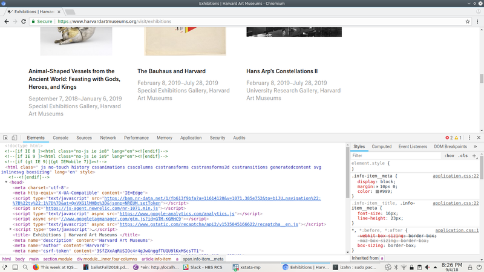
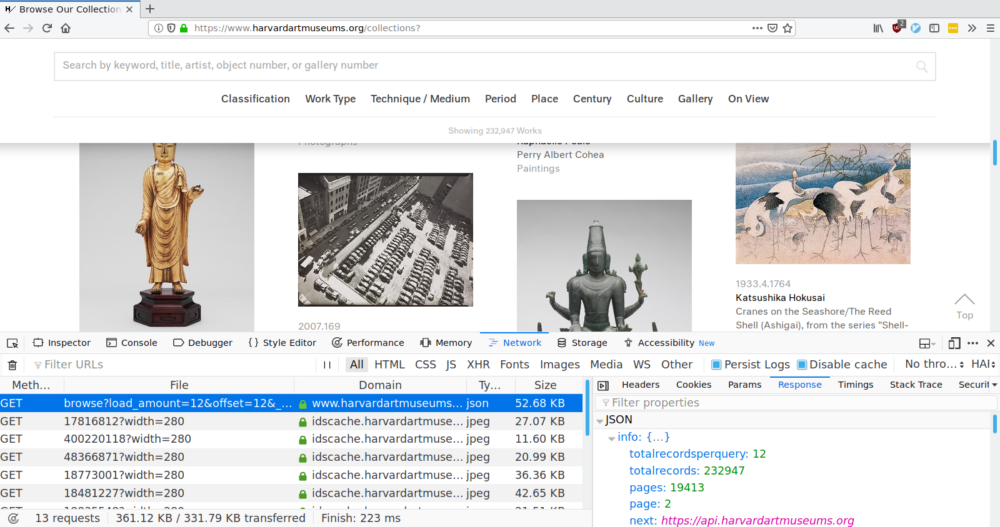
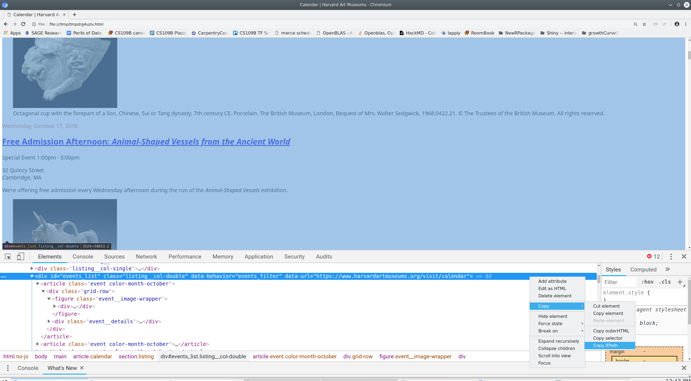
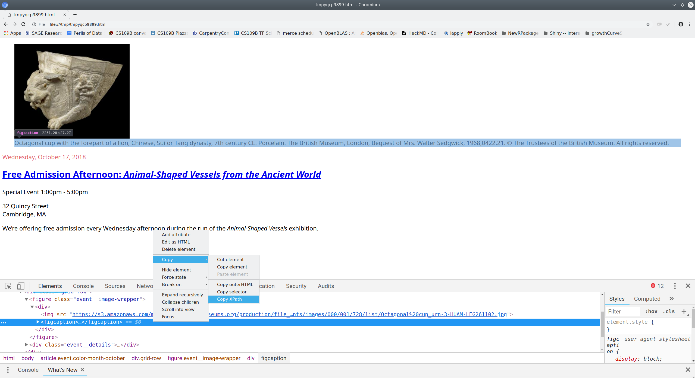

<style type="text/css">
pre code {
    display: block;
    unicode-bidi: embed;
    font-family: monospace;
    white-space: pre;
    max-height: 400px;
    overflow-x: scroll;
    overflow-y: scroll;
    }
</style>

```python
## This part is optional; it sets some printing options
## that make output look nicer.
from pprint import pprint as print
import pandas as pd
pd.set_option('display.width', 133)
pd.set_option('display.max_colwidth', 30)
pd.set_option('display.max_columns', 5)
```

## Setup instructions

###  Install the Anaconda Python distribution
If using your own computer please install the Anaconda Python
distribution from
[https://www.anaconda.com/download/](https://www.anaconda.com/download/).
(Note that Python version$\leq$ 3.0 differs considerably from more
recent releases. For this workshop you will need version$\geq$ 3.4.)

Accepting the defaults proposed by the Anaconda installer is generally
recommended. However, if it offers to install Microsoft Visual Studio
Code you may safely skip this step.

### Download workshop materials
Download the materials from
[http://tutorials.iq.harvard.edu/Python/PythonWebScrape.zip](http://tutorials.iq.harvard.edu/Python/PythonWebScrape.zip)
and extract the zipped directory (Right-click => Extract All on
Windows, double-click on Mac).


## Workshop goals and approach
In this workshop you will
- learn basic web scraping principles and techniques,
- learn how to use the requests package in Python,
- practice making requests and manipulating responses from the server.

This workshop is relatively *informal*, *example-oriented*, and
*hands-on*. We will learn by working through an example web scraping
project.

Note that this is **not** an introductory workshop. Familiarity with
Python, including but not limited to knowledge of lists and
dictionaries, indexing, and loops and / or comprehensions is assumed.
If you need an introduction to Python or a refresher, we recommend the
[IQSS Introduction to Python](https://dss.iq.harvard.edu/workshop-materials#widget-0).

Note also that this workshop will not teach you everything you need to
know in order to retrieve any data whatsoever from any webs service
whatsoever. This workshop will give you just enough to get started.

## Preliminary questions

### What is web scraping?
Web scraping the activity of automating retrieval of information from
a web service designed for human interaction.


### Is web scraping legal? Is it ethical?
It depends. If you have legal questions seek legal counsel. You can
mitigate some ethical issues by building delays and restrictions into
your web scraping program so as to avoid impacting the availability of
the web service for other users or the cost of hosting the service for
the service provider.
 


## Example project overview and goals
In this workshop I will demonstrate web scraping techniques using the
Exhibitions page at
<https://www.harvardartmuseums.org/visit/exhibitions> and let you use
the skills you'll learn to retrieve information from other parts of
the Harvard Art Museums website.

The basic strategy is pretty much the same for most scraping projects.
We will use our web browser (Chrome or Firefox recommended) to examin
the page you wish to retrieve data from, and copy/paste information
from your web browser into your scraping program.

## Take shortcuts if you can
We wish to extract information from
<https://www.harvardartmuseums.org/visit/exhibitions>. Like most
modern web pages, a lot goes on behind the scenes to produce the page
we see in our browser. Our goal is to pull back the curtain to see
what the website does when we interact with it. Once we see how the
website works we can start retrieving data from it. If we are lucky
we'll find a resource that returns the data we're looking for in a
structured format like [JSON](https://json.org/) or
[XML](https://en.wikipedia.org/wiki/XML).


### Examining the structure of our target web service

We start by opening that page in a web browser and inspecting it.




If we scroll down to the bottom of the Exhibitions page, we'll see a
button that says "Load More Exhibitions". Let's see what happens when
we click on that button.To do so, click on "Network" in the developer
tools window,then click the button. You should see a list of requests
that were made as a result of clicking that button, as shown below.




If we look at that second request, the one that to `load_next`, we'll
see that it returns all the information we need, in a convenient
format called `JSON`. All we need to retrieve exhibition data is call
make `GET` requests to
<https://www.harvardartmuseums.org/search/load_next> with the correct
parameters. 

### Making requests using python
The URL we want to retrieve data from has the following structure

    scheme                    domain              path                  parameters
     https www.harvardartmuseums.org  search/load_next type=past-exhibition&page=0

It is often convenient to create variables containing the domain(s)
and path(s) you'll be working with, as this allows you to swap out
paths and parameters as needed. Note that the path is separated from
the domain with `/` and the parameters are separated from the path
with `?`. If there are multiple parameters they are separated from
each other with a `&`.

For example, we can retrieve the first set of exhibitions in Python as
follows:

```python
museum_domain = 'https://www.harvardartmuseums.org'
exhibition_path = 'search/load_next'
exhibition_parameters = 'type=past-exhibition'

exhibition_url = (museum_domain
                  + "/"
                  + exhibition_path
                  + "?"
                  + exhibition_parameters)

print(exhibition_url)
```

Now that we've constructed the URL we wish interact with we're ready
to make our first request in Python.

```python
import requests

exhibitions0 = requests.get(exhibition_url 
                            + '&'
                            + 'page=0')
```

### Parsing JSON data
We already know from inspecting network traffic in our web
browser that this URL returns JSON, but we can use Python to verify
this assumption.
```python
exhibitions0.headers['Content-Type']
```

Since JSON is a structured data format, parsing it into python data
structures is easy. In fact, there's a method for that!

```python
exhibitions0 = exhibitions0.json()
print(exhibitions0)
```

That's it. Really, we are done here. Everyone go home!

OK not really, there is still more we can lean. But you have to admit
that was pretty easy. If you can identify a service that returns the
data you want in structured from, web scraping becomes a pretty
trivial enterprise. We'll discuss several other scenarios and topics,
but for some web scraping tasks this is really all you need to know.

### Organizing and saving the data

The records we retrieved from
`https://www.harvardartmuseums.org/museum_exhibitions/search/load_next`
are arranged as a list of dictionaries. With only a little trouble we
can select the fields of interest and arrange these data into a pandas
`DataFrame`. First lets see what fields are available.


```python
print(exhibitions0.keys())
```

```python
print(exhibitions0['records'][0].keys())
```

Next we can specify the fields we are interested in and use a dict
comprehension to organize the values;

```python
fields_to_keep = ['title', 'poster', 'people',
                  'begindate', 'enddate']

records0 = {k: [record.get(k, 'NA')
                for record in exhibitions0['records']]
            for k in fields_to_keep}

```
Finally we can convert the dict to a `DataFrame`

```python
import pandas as pd

records0 = pd.DataFrame.from_dict(records0)

print(records0)
```

and write the data to a file.

```python
records0.to_csv("records0.csv")
```

### Iterating to retrieve all the data

Of course we don't want just the first page of exhibitions. How can we
retrieve all of them?

The first page of JSON data we retrieved contains meta data about the
number of records, in the `info` field. It looks like this:

```python
print(exhibitions0['info'])
```

Now that we know how many pages there are we can iterate over them

```python
records = [requests.get(exhibition_url
                        + '&'
                        + 'page='
                        + str(page)).json()['records']
           for page in range(1, exhibitions0['info']['pages'] + 1)]
```

For convenience we can flatten the records in each list into one long
`records` list

```python
records_final = []
for record in records:
    records_final += record
```

As before, we can write the data to a .csv file without too much
difficulty:

```python
records_final = {k: [record.get(k, 'NA')
                     for record in records_final]
                 for k in fields_to_keep}

## convert the dict to a `DataFrame`
records_final = pd.DataFrame.from_dict(records_final)

# write the data to a file.
records_final.to_csv("records_final.csv")

print(records_final)
```

### Exercise: Retrieve exhibits data
In this exercise you will retrieve information about the art
collections at Harvard Art Museums from
`https://www.harvardartmuseums.org/collections`

1. Using a web browser (Firefox or Chrome recommended) inspect the
   page at `https://www.harvardartmuseums.org/collections`. Examine
   the network traffic as you interact with the page. Try to find
   where the data displayed on that page comes from.
2. Make a `get` request in Python to retrieve the data from the URL
   identified in step1.
3. Write a *loop* or *list comprehension* in Python to retrieve data
   for the first 5 pages of collections data.
4. Bonus (optional): Arrange the data you retrieved into dict of
   lists. Convert it to a pandas `DataFrame` and save it to a `.csv`
   file.
   
## Parse html if you have to
As we've seen, you can often inspect network traffic or other sources
to locate the source of the data you are interested in and the API
used to retrieve it. You should always start by looking for these
shortcuts and using them where possible. If you are really lucky,
you'll find a shortcut that returns the data as JSON or XML. If you
are not quite so lucky, you will have to parse HTML to retrieve the
information you need.

For example, when I inspected the network traffic while interacting
with <https://www.harvardartmuseums.org/visit/calendar> I didn't see
any requests that returned JSON data. The best we can do appears to be
<https://www.harvardartmuseums.org/visit/calendar?type=&date=>, which
unfortunately returns  HTML. 

### Retrieving HTML
The first step is the same as before: we make at `GET` request.

```python
calendar_path = 'visit/calendar'

calendar_url = (museum_domain # recall that we defined museum_domain earlier
                  + "/"
                  + calendar_path)

print(calendar_url)

events0 = requests.get(calendar_url)
```

As before we can check the headers to see what type of content we
received in response to our request.

```python
events0.headers['Content-Type']
```

### Parsing HTML using the lxml library
Like JSON, HTML is structured; unlike JSON it is designed to be
rendered into a human-readable page rather than simply to store and
exchange data in a computer-readable format. Consequently, parsing
HTML and extracting information from it is somewhat more difficult
than parsing JSON.

While JSON parsing is built into the Python `requests` library, parsing
HTML requires a separate library. I recommend using the HTML parser
from the `lxml` library; others prefer an alternative called
`BeautyfulSoup`.

```python
from lxml import html

events_html = html.fromstring(events0.text)
```

### Using xpath to extract content from HTML
`XPath` is a tool for identifying particular elements withing a HTML
document. The developer tools built into modern web browsers make it
easy to generate `XPath`s that can used to identify the elements of a
web page that we wish to extract.

We can open the html document we retrieved and inspect it using
our web browser.

```python
html.open_in_browser(events_html, encoding = 'UTF-8')
```


Once we identify the element containing the information of interest we
can use our web browser to copy the `XPath` that uniquely identifies
that element.



Next we can use python to extract the element of interest:

```python
events_list_html = events_html.xpath('//*[@id="events_list"]')[0]
```

Once again we can use a web browser to inspect the HTML we're
currently working with, and to figure out what we want to extract from
it. Let's look at the first element in our events list.

```python
first_event_html = events_list_html[0]
html.open_in_browser(first_event_html, encoding = 'UTF-8')
```

As before we can use our browser to find the xpath of the elements we
want.



(Note that the `html.open_in_browser` function adds enclosing `html`
and `body` tags in order to create a complete web page for viewing.
This requires that we adjust the `xpath` accordingly.)

By repeating this process for each element we want, we can build a
list of the xpaths to those elements.

```python
elements_we_want = {'figcaption': 'div/figure/div/figcaption',
                    'date': 'div/div/header/time',
                    'title': 'div/div/header/h2/a',
                    'time': 'div/div/div/p[1]/time',
                    'localtion1': 'div/div/div/p[2]/span/span[1]',
                    'location2': 'div/div/div/p[2]/span/span[2]'
                    }
```

Finally, we can iterate over the elements we want and extract them.

```python
first_event_values = {key: first_event_html.xpath(
    elements_we_want[key])[0].text_content().strip()
                      for key in elements_we_want.keys()}

print(first_event_values)
```

### Iterating to retrieve content from a list of HTML elements
So far we've retrieved information only for the first event. To
retrieve data for all the events listed on the page we need to iterate
over the events. If we are very lucky, each event will have exactly
the same information structured in exactly the same way and we can
simply extend the code we wrote above to iterate over the events list.

Unfortunately not all these elements are available for every event, so
we need to take care to handle the case where one or more of these
elements is not available. We can do that by defining a function that
tries to retrieve a value and returns an empty string if it fails.

```python
def get_event_info(event, path):
    try:
        info = event.xpath(path)[0].text.strip()
    except:
        info = ''
    return info
```

Armed with this function we can iterate over the list of events and
extract the available information for each one.

```python
all_event_values = {key: [get_event_info(event, elements_we_want[key])
                        for event in events_list_html]
                    for key in elements_we_want.keys()}
```

For convenience we can arrange these values in a pandas `DataFrame`
and save them as .csv files, just as we did with our exhibitions data earlier.

```python
all_event_values = pd.DataFrame.from_dict(all_event_values)

all_event_values.to_csv("all_event_values.csv")

print(all_event_values)
```

### Exercise: parsing HTML
In this exercise you will retrieve information about the physical
layout of the Harvard Art Museums. The web page at
<https://www.harvardartmuseums.org/visit/floor-plan> contains this
information in HTML from.

1. Using a web browser (Firefox or Chrome recommended) inspect the
   page at `https://www.harvardartmuseums.org/visit/floor-plan`. Copy
   the `XPath` to the element containing the list of level
   information. (HINT: the element if interest is a `ul`, i.e.,
   `unordered list`.)
2. Make a `get` request in Python to retrieve the web page at
   <https://www.harvardartmuseums.org/visit/floor-plan>. Extract the
   content from your request object and parse it using `html.fromstring`
   from the `lxml` library.
3. Use your web browser to find the `XPath`s to the facilities housed on
   level one. Use Python to extract the text from those `Xpath`s.
4. Bonus (optional): Write a *loop* or *list comprehension* in Python
   to retrieve data for all the levels.


## Use a browser driver as a last resort

TODO

## Use Scrapy for large or complicated projects

TODO
